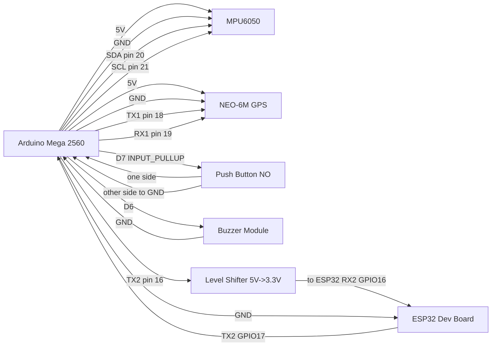

# VestMicro Wiring Diagram

This document maps the exact pin usage from the current firmware.

## Main Connections

## Pin Map

| Function | Arduino Mega 2560 | Remote Device Pin |
|---|---|---|
| MPU6050 SDA | 20 (SDA) | SDA |
| MPU6050 SCL | 21 (SCL) | SCL |
| MPU6050 Power | 5V / GND | VCC / GND |
| GPS UART TX from Mega | 18 (TX1) | GPS RX |
| GPS UART RX to Mega | 19 (RX1) | GPS TX |
| ESP32 UART TX from Mega | 16 (TX2) | ESP32 RX2 GPIO16 (through level shifter) |
| ESP32 UART RX to Mega | 17 (RX2) | ESP32 TX2 GPIO17 |
| Push button input | 7 (INPUT_PULLUP) | Other side to GND |
| Buzzer control | 6 | Buzzer signal |

## Important Electrical Notes

- Use a common ground between Mega, ESP32, GPS, MPU6050, and buzzer module.
- Mega TX2 is 5V logic and ESP32 RX is 3.3V tolerant only. Use a level shifter or divider on Mega TX2 -> ESP32 RX2.
- ESP32 TX2 (3.3V) to Mega RX2 is generally safe directly.
- If your buzzer is not a module with built-in driver transistor, drive it through a transistor and a flyback diode (for magnetic buzzers).

## Quick Bring-Up Check

1. Power only Mega + MPU6050 first and confirm MPU detection over Serial Monitor.
2. Add GPS and verify valid coordinates appear.
3. Add ESP32 UART link and confirm ESP32 prints parsed EVT packets.
4. Test button and buzzer state changes (MANUAL/CLEAR, CRASH flow).
